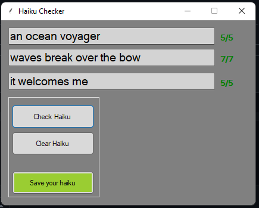

# Haiku-Checker
## Easilly create your own Haikus while making sure they are 5/7/5.

if you properly create a haiku then you can save it to your computer.
a directory called 'haikus' will be generated and your haiku will be placed inside.

## Contact me/Issues:  
Discord: NC#6215

